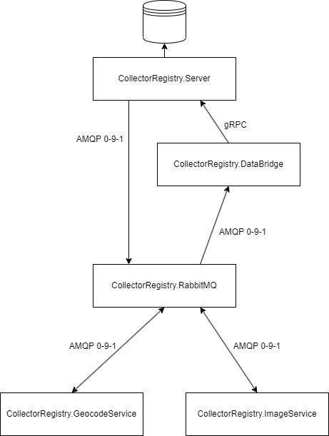

# CollectorRegistry

Multi tenant automotive registry site using Blazor WebAssembly and SQL Server. Influenced by my own previous [SVO Registry](https://github.com/srenner/svoregistry-v2) project.

The app is developed with rare collector cars in mind, but the registry can also be used to host other collectibles. The primary requirement for a registry site is to have items with unique serial numbers. The registry is particularly useful to check the ownership history of a specific item you are looking to buy.

## Tech in use
C#, .NET 7, SQL Server, Blazor, Docker, Microservices, RabbitMQ, gRPC, Linux

## High Level Architecture

## Useful links
- [gRPC for .NET](https://github.com/grpc/grpc-dotnet)